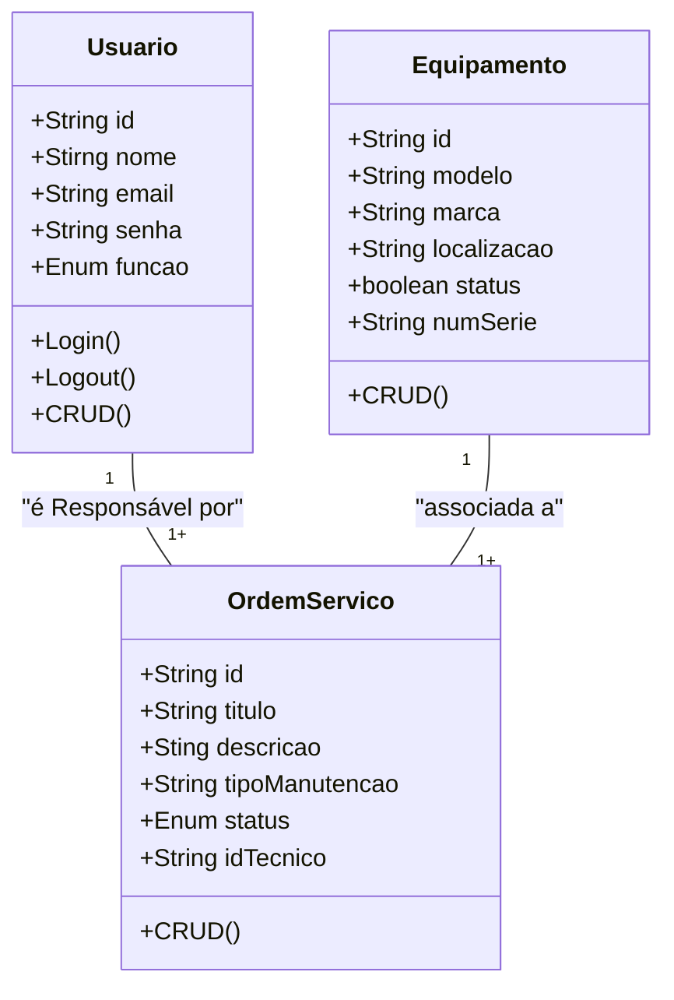
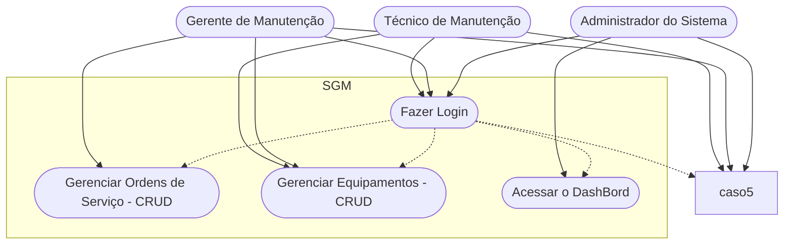

# Sistema de Gestão de Manutenção (SGM)

## Briefing
O projeto consiste no desenvolvimento de um Sistema de Gestão de Manutenção (SGM) no formato de uma aplicação web. O objetivo é centralizar e otimizar o controle das atividades de manutenção de máquinas e equipamentos de uma empresa. A plataforma permitirá o cadastro de equipamentos, agendamento de manutenções preventivas e corretivas, e o gerenciamento de ordens de serviço.

## Objetivo do Projeto
- Gerenciar informações sobre equipamentos e manutenções realizadas pela empresa
- Realizar abertura de chamados de manutenção (ordens de serviço)
- Dashboard de históricos de manutenção
- Proteger acesso aos dados do sistema (criptografia e autenticação segura de usuários)

## Público-Alvo
- Técnicos de Manutenção (usuários finais)
- Gestores de Manutenção (usuários intermediários)
- Administradores do Sistema (gerenciar a permissão dos usuários)

## Levantamento de Requisitos do Projeto
- ### Requisitos Funcionais

- ### Requisitos Não Funcionais

## Recursos do Projeto
- ### Tecnológicos
    - Framework de Desenvolvimento: Next/React
    - Linguagem de Programação: TypeScript
    - Banco de Dados: Não Relacional (MongoDB)
    - Platafroma de Hospedagem do Código: GitHub
    - IDE: VSCode
    - Recurso de Prototipagem: Figma

- ### Humanos
    - Desenvolvedor de Software

## Análise de Risco

## Diagramas

1. ### Classe
Descrever o Comportamento das Entidades de um Projeto

    - Usuário (User/Usuario)
        - Atributos: id, nome, email, senha, funcao
        - Métodos: create, read, update, delete, login, logout

    - Equipamento (Equipment/Equipamento)
        - Atributos: id, modelo, marca, localizaçao, status,numeroSerie
        - Métodos: CRUD

    - Ordem de Serviço (OrdemServico)
        - Atributos: id, titulo, descricao, tipoManutencao, status, idTecnico, idEquipamento

2. ### Casos de Uso
Ilustra as interações dos diferentes tipos de usuários (Atores) com as funcionalidades do sistema

- Casos de Uso:
    - Técnico: Gerenciar Ordens de Serviço (CRUD) e acessar o Dashboard;
    - Gerente: funções do técnico + Gerenciamento de Equipamentos (CRUD);
    - Admin: Gerenciar Usuários do Sistema e acessar o Dashboard

    Fazer o login -> Antes de Qualquer Ação

