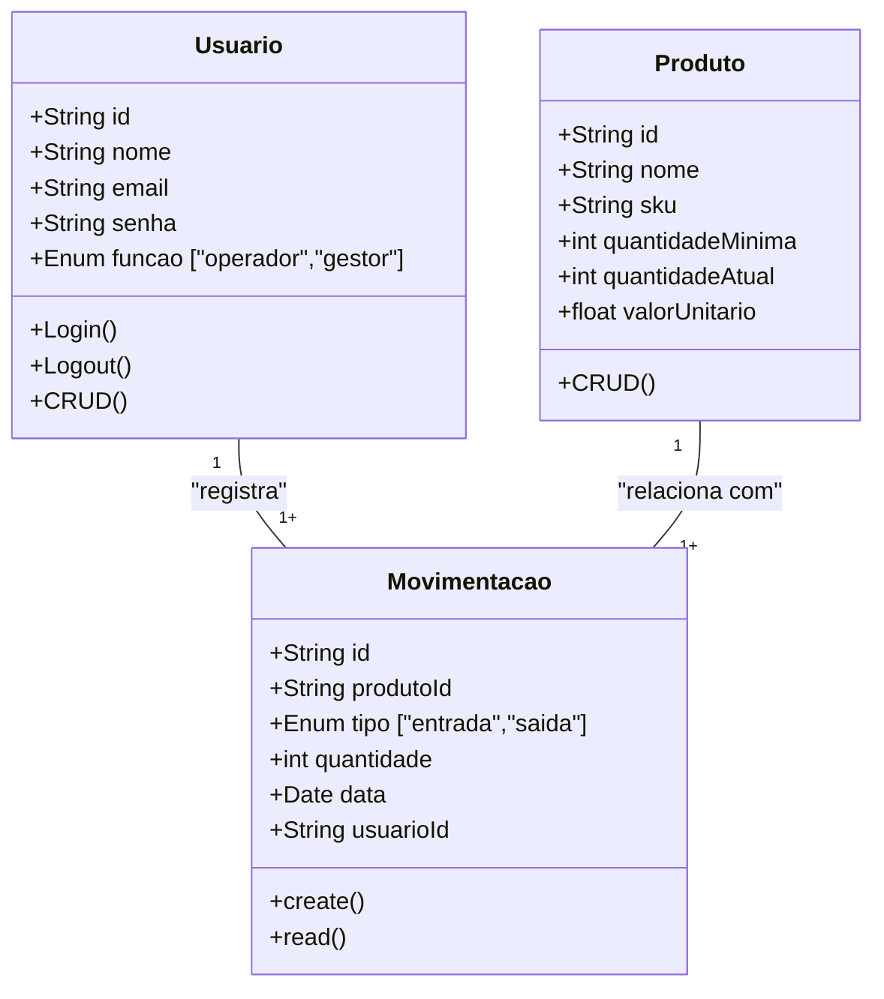
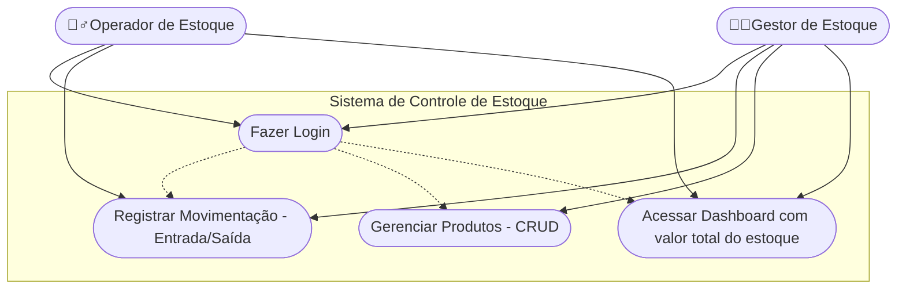

# Sistema de Controle de Estoque 

## Briefing
O projeto consiste no desenvolvimento de um Sistema de Controle de Estoque no formato de uma aplicação web. O objetivo é facilitar o controle de produtos de escritório da empresa. O sistema permitirá cadastrar produtos, registrar entradas e saídas e destacar os itens com quantidade abaixo do mínimo. Também contará com uma página de visualização dos produtos e de suas movimentações no estoque.

## Objetivo do Projeto
- Gerenciar informações sobre produtos de escritório da empresa
- Registrar movimentações de estoque (entradas e saídas de produtos), com data e operador responsável
- Exibir um dashboard com dados sobre produtos mais movimentados e o valor total do estoque
- Proteger acesso aos dados do sistema (criptografia e autenticação segura de usuários)

## Público-Alvo
- Gestor de Estoque: possui acesso total ao sistema (CRUD de produtos, relatórios e dashboards).
- Operador de Estoque: pode registrar movimentações (entrada e saída de produtos).

## Levantamento de Requisitos do Projeto
- ### Requisitos Funcionais
    - Cadastrar, editar e excluir produtos.
    - Listar todos os produtos cadastrados.
    - Registrar entradas e saídas de produtos.
    - Mostrar os produtos que estão abaixo da quantidade mínima.
    - Permitir login de usuários (gestor e operador).
    - Exibir um dashboard simples com resumo do estoque.
    - Calcular e exibir o valor total do estoque.

- ### Requisitos Não Funcionais
    - O sistema deve ser feito em Next.js.
    - A interface deve ser simples e responsiva.
    - Os dados podem ser salvos em JSON Server ou LocalStorage.
    - O sistema deve ser fácil de usar e entender.
    - As páginas devem carregar rapidamente.

## Recursos do Projeto
- ### Tecnológicos
    - Framework de Desenvolvimento: Next/React
    - Linguagem de Programação: TypeScript
    - Banco de Dados: Não Relacional (MongoDB)
    - Controle de Versão: GitHub
    - IDE: VSCode
    - Recurso de Prototipagem: Figma

- ### Humanos
    - Desenvolvedor de Software

## Análise de Risco
- Perda de dados: pode ocorrer se o armazenamento local for apagado → solução: fazer backup manual ou usar JSON Server.
- Erros de digitação: podem gerar informações erradas no estoque → solução: validar campos antes de salvar.
- Falha na internet: impede o uso da aplicação online → solução: permitir uso básico offline (ou esperar reconexão).
- Dificuldade de uso: usuários podem ter dúvidas ao usar o sistema → solução: criar interface simples e intuitiva.
- Falta de manutenção do código: o sistema pode ficar desatualizado → solução: manter controle de versão no GitHub.

## Diagramas

1. ### Classe
Descrever o Comportamento das Entidades de um Projeto

    - Usuário (User/Usuario)
        - Atributos: id, nome, email, senha, funcao
        - Métodos: create, read, update, delete, login, logout

    - Produto (Product/Produto)
        - Atributos: id, nome, sku, quantidadeMinima, quantidadeAtual,valorUnitario
        - Métodos: create, read, update e delete

    - Movimentação (Movimentacao)
        - Atributos: id, produtoId, tipo, quantidade, data, usuarioId
        - Métodos: create e read



2. ### Casos de Uso
Ilustra as interações dos diferentes tipos de usuários (Atores) com as funcionalidades do sistema

- Casos de Uso:
    - Operador: registra entradas e saídas, consulta produtos.
    - Gestor: faz tudo que o operador faz + gerencia produtos (CRUD) + acessa dashboard.

    Fazer o login -> Antes de Qualquer Ação



3. ### Fluxo
Detalha o passo a passo para realizar uma ação no sistema

- Diagrama de fluxo de login
    - O usuário acessa a tela de login
    - Insere as credenciais
    - O sistema verifica as Credenciais
        - se sim: gera um JWT (Token) => DashBoard
        - se não: manda uma mensagem de erro - Permanece na tela de Login

```mermaid

graph TD
    A[Início] --> B{Acessa a tela de Produtos}
    B --> C[Selecionar Produto]
    C --> D[Escolher Tipo de Movimentação (Entrada/Saída)]
    D --> E[Inserir Quantidade]
    E --> F{Validar Quantidade}
    F -->|Válida| G[Registrar Movimentação e Atualizar Produto]
    G --> H[Exibir Confirmação e atualizar valor total do estoque]
    F -->|Inválida| I[Exibir Mensagem de Erro]
    I --> B

```

## Protótipos

https://www.figma.com/design/nyVrhHc6uDSuKG8gCaeGY9/Controle-de-Estoque-Prot%C3%B3tipo-M%C3%A9dia---Fidelidade?node-id=0-1&t=jOdbDKoRAIdNCwUh-1