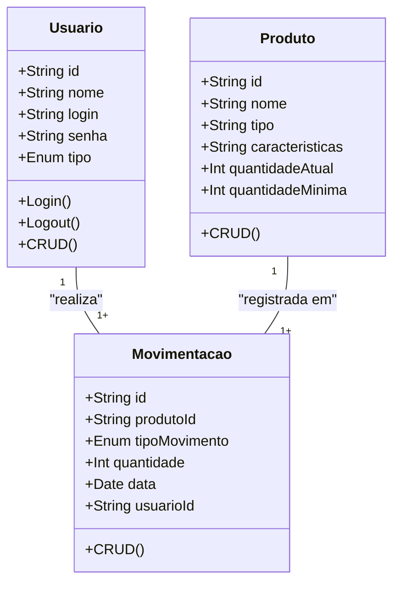

# Sistema de Controle de Estoque

## Briefing

O projeto consiste no desenvolvimento de um Sistema de Controle de Estoque no formato de uma aplicação web. O objetivo é centralizar e otimizar o gerenciamento de ferramentas e equipamentos manuais de uma empresa. A plataforma permitirá o cadastro de produtos, controle de entrada e saída de itens, monitoramento de estoque mínimo e registro detalhado de movimentações utilizando JSON Server como backend simulado.

## Objetivo do Projeto

- Gerenciar informações sobre produtos (id, nome, quantidade, estoque mínimo).
- Registrar entrada e saída de produtos do estoque.
- Emitir alertas automáticos quando o estoque de um produto estiver abaixo do mínimo configurado.
- Garantir rastreabilidade das movimentações com registro de usuário e data.
- Proteger acesso aos dados do sistema com autenticação simples de usuários.

## Público-Alvo

- Gestores de Estoque

## Levantamento de Requisitos do Projeto

### Requisitos Funcionais

- Autenticação de usuários (login/logout)
- Cadastro, edição, exclusão e listagem de produtos
- Movimentações de estoque (entrada/saída)
- Alertas automáticos de estoque mínimo
- Histórico detalhado de movimentações
- Busca e filtro de produtos
- Exibição do usuário logado na interface principal

### Requisitos Não Funcionais

- Validação de dados nos formulários de cadastro e movimentação
- Registro de logs de movimentações para auditoria
- Uso de JSON Server para armazenamento e simulação de banco de dados

## Lista de Requisitos de Infraestrutura

- SGBD: JSON Server (versão 0.17.3)
- Linguagem de Programação: HTML, CSS e JavaScript (ES6)
- Sistema Operacional: Windows 10/11 (ou Linux)
- Navegadores Compatíveis: Chrome, Firefox, Edge
- IDE Recomendada: VSCode

## Análise de Risco

- Perda de dados → mitigado com backup do arquivo JSON
- Inserção de produtos duplicados → mitigado com validação de campos únicos
- Movimentação incorreta de estoque → mitigado com alertas e validações no frontend

## Diagramas
1. Entidade e Relacionamento (DER)

- Usuário (User/Usuario)
    - Atributos: id, nome, login, senha, tipo
    - Métodos: create, read, update, delete, login, logout

- Produto (Product/Produto)
    - Atributos: id, nome, tipo, caracteristicas, quantidadeAtual, quantidadeMinima
    - Métodos: CRUD

- Movimentação (Movimentacao)
    - Atributos: id, produtoId, tipoMovimento (entrada/saída), quantidade, data, usuarioId
    - Métodos: create, read

## Script de Criação e População do Banco de Dados

O sistema usa JSON Server. O próprio arquivo db.json funciona como script de criação e população do banco.

Local: backend/db.json

Para rodar a API:
json-server --watch backend/db.json --port 3000

## Descritivo de Teste de Software

### Ferramentas e Ambiente

- Navegador: Chrome, Firefox, Edge
- JSON Server (db.json)
- VSCode
- Rede local funcionando

### Casos de Teste Principais

- Login: Usuário válido acessa Home; usuário inválido recebe alerta.
- Cadastro de Produto: Adicionar produto com dados válidos; alertar se campos inválidos.
- Edição/Exclusão de Produto: Atualizar ou remover produto e refletir na tabela.
- Busca de Produto: Filtrar produtos por termo de busca.
- Movimentação de Estoque: Registrar entrada/saída; atualizar quantidade; alertar se estoque abaixo do mínimo.
- Logout: Deslogar e retornar à tela de login.
- Histórico de Movimentações: Exibir todas as movimentações registradas com dados completos (produto, tipo, quantidade, data, usuário).

